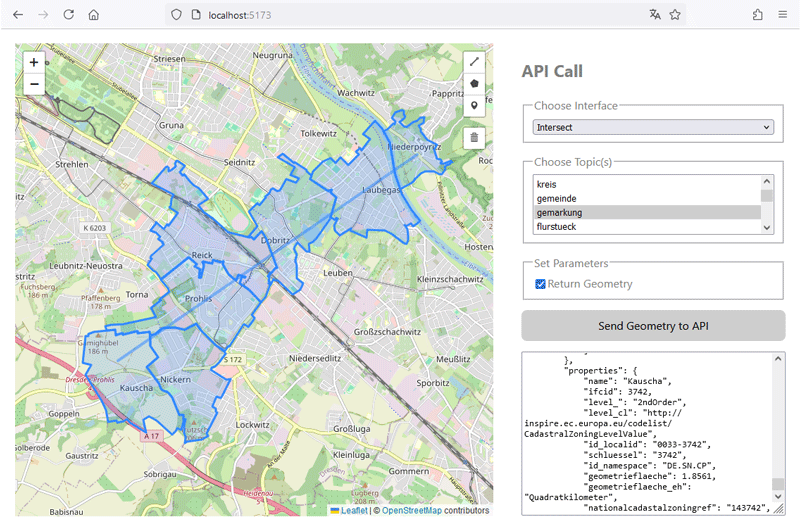

# Demo Map Client for GeospatialAnalyzer API

## General

This is a simple demo map client for the [GeospatialAnalyzer API](https://github.com/geobakery/GeospatialAnalyzer). It provides a Leaflet and OpenStreetMap based map to show some integration examples.

It is built using React, TypeScript, Vite and React Leaflet.



### What is working

- Show the bounding box (hardcoded) from the sample data
- Draw geometries
- Choose interface
- Choose topic(s)
- Set parameters
- Selection fields for interface, topics and parameters depend on each other
- Make an API call
- Show response
- Show returned geometry in map
- Docker deployment

### To do

- Improve geometry handling
- Send more than one geometry to API
- Make it mobile friendly
- Fine-tuning in general
- Update topics when GA is ready
- Introduce a config file for interfaces, topics, bounding box and so on

## Configuration

Before running the application, you need to create a `.env` file to configure your environment variables. You can use the provided `.env.example` file as a template.

## Development

Prettier, Linter and HMR are configured. Tested in VS Code.

### Install and run

```
pnpm install
pnpm run dev
```

Open [http://localhost:5173/](http://localhost:5173/) in your browser.

## Docker Deployment

### Create the Docker Image

This command builds the Docker image from the Dockerfile and tags it as `ga-client`.

```
docker build -t ga-client .
```

### Run the Docker Image

This command runs the previously built image as a container and exposes it on port 80.

```
docker run -p 80:80 ga-client
```

## Contribution

You are welcome to co-develop :)

## License

This project is licensed under the [GNU General Public License 3 (GPLv3)](./LICENSE).

For information about third-party component licenses, see the [THIRD-PARTY-LICENSES file](./THIRD-PARTY-LICENSES.md).
