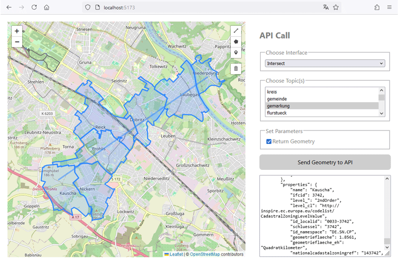

# Demo Map Client for GeospatialAnalyzer API

## General

This is a simple demo map client for the [GeospatialAnalyzer API](https://github.com/geobakery/GeospatialAnalyzer). It provides a Leaflet and OpenStreetMap based map to show some integration examples.

It is built using React, TypeScript, Vite and React Leaflet.



### Features

- Load available topics dynamically from the API
- Override the API URL at runtime
- Draw geometries
- Choose interface
- Choose topic(s)
- Set some API-supported parameters
- Make an API call
- Show response
- Show returned geometry in map
- Config file for the bounding box and other settings
- Show the bounding box (hardcoded) from the sample data
- Docker/Podman deployment

## Configuration

Before running the application, you need to create a `.env` file to configure your environment variables. You can use the provided `.env.example` file as a template. `VITE_API_URL` sets the API base URL (including the version segment). It can also be overridden at runtime via the input field in the UI.

The available topics are loaded dynamically from the API. You can customize the bounding box and other settings in `src/config/config.ts`.

Depending on the deployment environment, consider adjusting `port_in_redirect` in `default.conf`. Disable it when running behind a reverse proxy and enable it for direct access (e.g. during local development) so redirects include the port. This ensures that `/ga-client` is redirected correctly to `/ga-client/` in both cases.

## Development

Prettier, Linter and HMR are configured. Tested in VS Code.

### Install and run

```
pnpm install
pnpm run dev
```

Open [http://localhost:5173/](http://localhost:5173/) in your browser.

## Docker Deployment

### Create the Docker Image

This command builds the Docker image from the Dockerfile and tags it as `ga-client`.

```
docker build -t ga-client .
```

### Run the Docker Image

This command runs the previously built image as a container and exposes it on port `80`.

```
docker run -p 80:8080 ga-client
```

## Contribution

You are welcome to co-develop :)

## License

This project is licensed under the [GNU General Public License 3 (GPLv3)](./LICENSE).

For information about third-party component licenses, see the [THIRD-PARTY-LICENSES file](./THIRD-PARTY-LICENSES.md).
